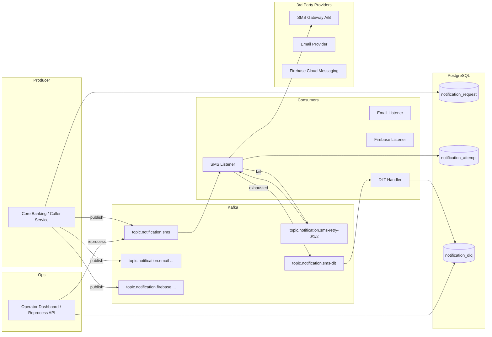
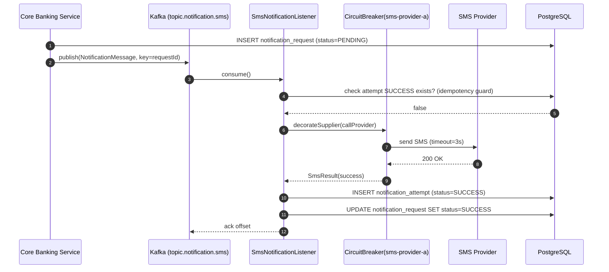
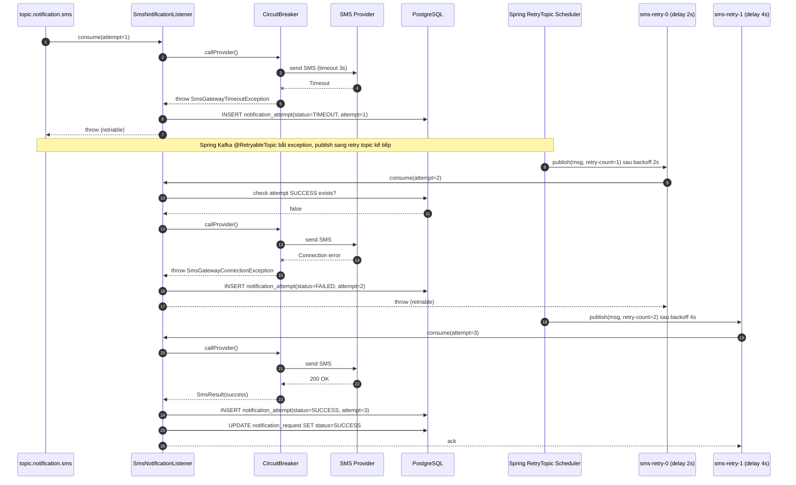
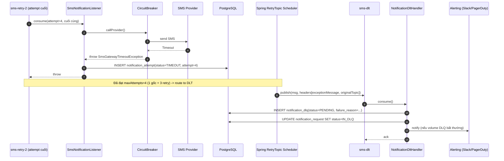
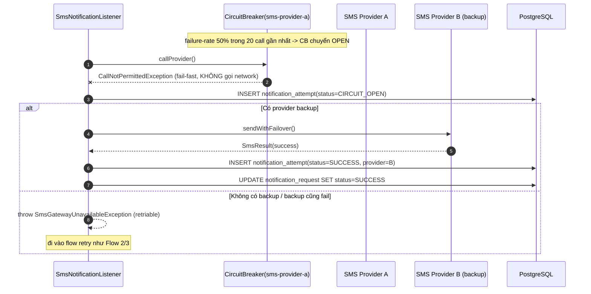
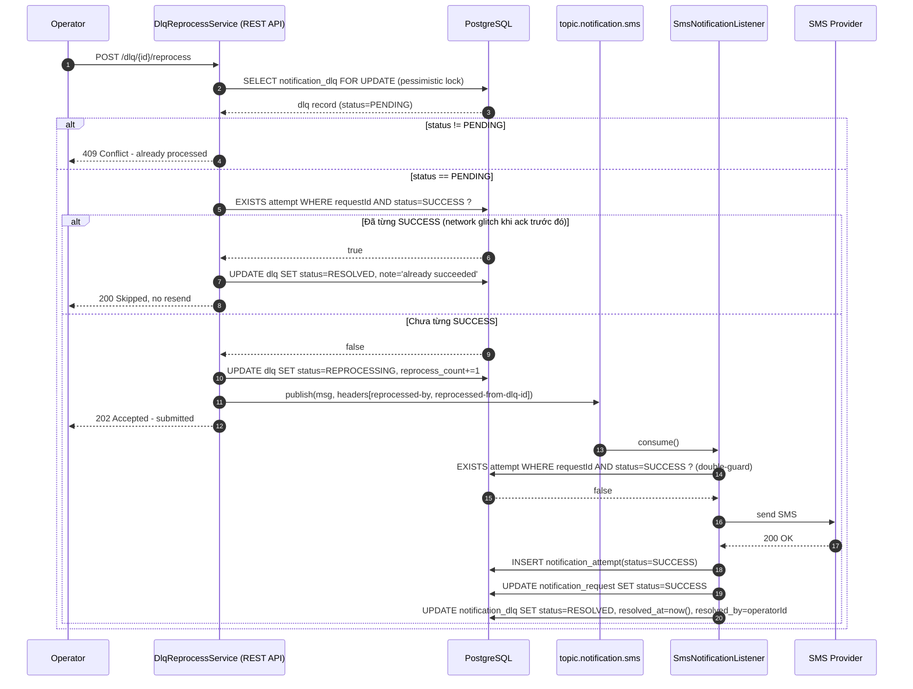
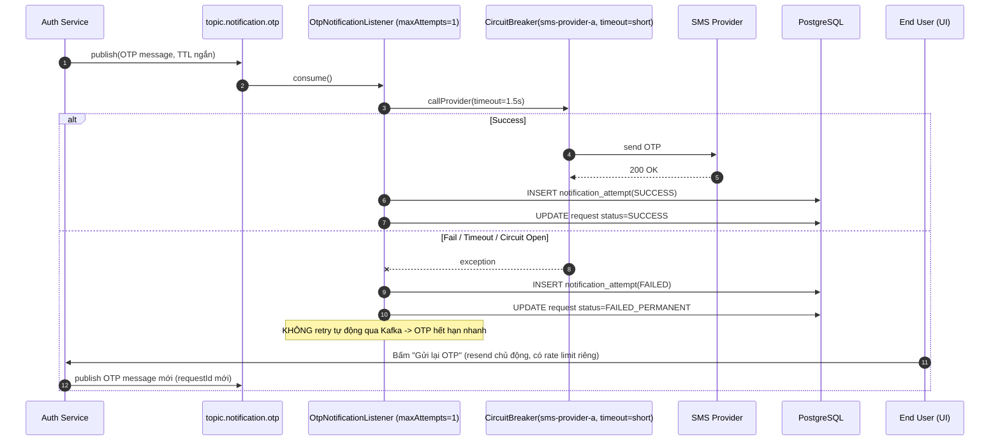
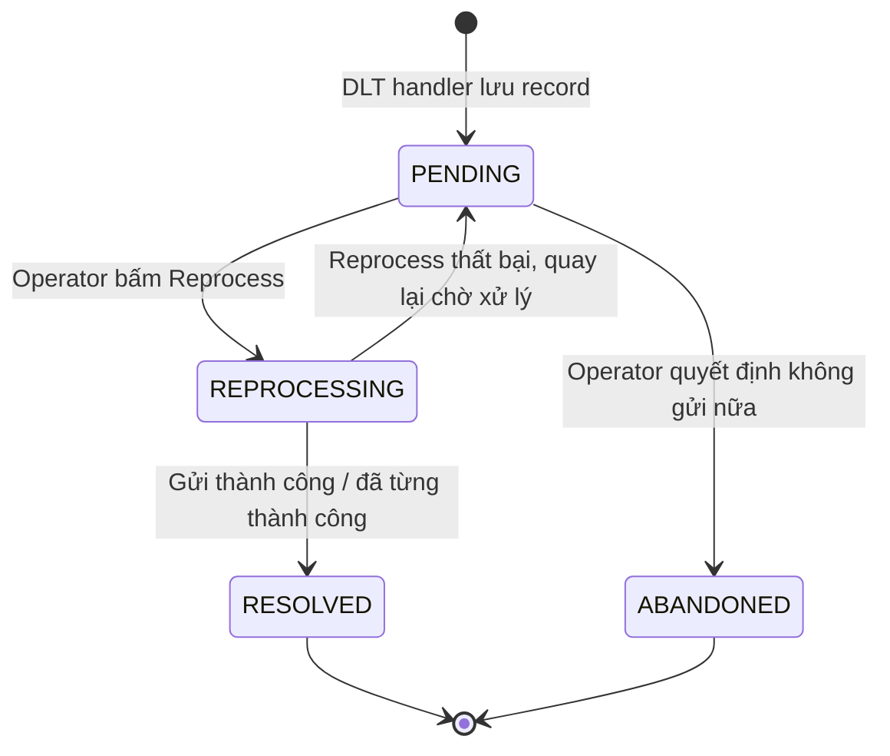

# Notification Service — Design Document
### Kafka-based Retry + DLQ + Circuit Breaker + Idempotent Reprocess
**Domain:** Banking (SMS / Email / Firebase Realtime)
**Version:** 1.0

---

## 1. Mục tiêu & Phạm vi

Notification Service chịu trách nhiệm gửi thông báo (SMS, Email, Firebase push) tới khách hàng thông qua các nhà cung cấp bên thứ 3 (3rd party gateway), với các yêu cầu:

- Xử lý bất đồng bộ qua Kafka, tách biệt theo channel (sms/email/firebase).
- Tự động retry khi gọi 3rd party thất bại (timeout, connection error) tối đa **3 lần** với backoff tăng dần.
- Phân loại lỗi retriable / non-retriable để tránh retry vô ích.
- Circuit breaker riêng theo từng provider để fail-fast khi provider down.
- Khi hết số lần retry → đẩy vào Dead Letter Queue (DLQ), lưu DB để operator xử lý thủ công.
- Đảm bảo idempotency xuyên suốt (không gửi trùng SMS/email cho khách hàng), có đầy đủ audit trail phục vụ compliance banking.

---

## 2. Kiến trúc tổng quan



---

## 3. Topic Design

| Topic | Mục đích | Partitions gợi ý | Ghi chú |
|---|---|---|---|
| `topic.notification.sms` | Request gốc cho SMS | 6+ | Key = `requestId` để đảm bảo order theo request |
| `topic.notification.sms-retry-0/1/2` | Retry tự động (Spring Kafka `@RetryableTopic` tự sinh) | 3 | Backoff tăng dần |
| `topic.notification.sms-dlt` | Dead Letter Topic | 1-3 | Consumer là `NotificationDltHandler` |
| `topic.notification.email` (+ retry/dlt tương tự) | Email | 3+ | SLA lỏng hơn SMS |
| `topic.notification.firebase` (+ retry/dlt) | Push notification | 3+ | |
| `topic.notification.otp` | OTP riêng, **không** qua retry topic chuẩn | 6+ | Fail-fast, xem mục 7 |

**Quy ước header message:**

| Header | Kiểu | Mô tả |
|---|---|---|
| `requestId` | String (UUID) | Định danh duy nhất của notification request |
| `idempotencyKey` | String | SHA-256 hash, dùng để chống trùng |
| `retry-count` | Int | Do Spring Kafka tự quản lý |
| `reprocessed-from-dlq-id` | Long (optional) | Có khi message được operator reprocess |
| `reprocessed-by` | String (optional) | operatorId |

---

## 4. Database Schema

```sql
CREATE TABLE notification_request (
    id              BIGSERIAL PRIMARY KEY,
    request_id      UUID NOT NULL UNIQUE,
    idempotency_key VARCHAR(64) NOT NULL UNIQUE,
    channel         VARCHAR(20) NOT NULL,      -- SMS, EMAIL, FIREBASE, OTP
    recipient       VARCHAR(255) NOT NULL,
    template_id     VARCHAR(50),
    payload         JSONB NOT NULL,
    priority        VARCHAR(10) DEFAULT 'NORMAL', -- HIGH, NORMAL, LOW
    status          VARCHAR(20) NOT NULL,      -- PENDING, SUCCESS, FAILED_PERMANENT, IN_DLQ
    business_date   DATE NOT NULL,
    created_at      TIMESTAMPTZ NOT NULL DEFAULT now()
);

CREATE TABLE notification_attempt (
    id              BIGSERIAL PRIMARY KEY,
    request_id      UUID NOT NULL REFERENCES notification_request(request_id),
    attempt_number  INT NOT NULL,
    provider_name   VARCHAR(50),
    status          VARCHAR(20) NOT NULL,      -- SUCCESS, FAILED, TIMEOUT, CIRCUIT_OPEN
    provider_response JSONB,
    error_code      VARCHAR(50),
    error_message   TEXT,
    called_at       TIMESTAMPTZ NOT NULL DEFAULT now(),
    duration_ms     INT
);
CREATE INDEX idx_attempt_request_status ON notification_attempt(request_id, status);

CREATE TABLE notification_dlq (
    id                  BIGSERIAL PRIMARY KEY,
    request_id          UUID NOT NULL REFERENCES notification_request(request_id),
    channel             VARCHAR(20) NOT NULL,
    payload             JSONB NOT NULL,
    failure_reason      TEXT,
    dlq_status          VARCHAR(20) NOT NULL DEFAULT 'PENDING', -- PENDING, REPROCESSING, RESOLVED, ABANDONED
    reprocess_count     INT NOT NULL DEFAULT 0,
    moved_to_dlq_at     TIMESTAMPTZ NOT NULL DEFAULT now(),
    resolved_at         TIMESTAMPTZ,
    resolved_by         VARCHAR(100),
    resolve_note        TEXT
);
CREATE INDEX idx_dlq_status ON notification_dlq(dlq_status);
```

---

## 5. Sequence Diagram — Flow 1: Happy Path (Success)



---

## 6. Sequence Diagram — Flow 2: Retry (Timeout) đến Success



---

## 7. Sequence Diagram — Flow 3: Retry hết lượt → DLQ



---

## 8. Sequence Diagram — Flow 4: Circuit Breaker OPEN (fail-fast)



---

## 9. Sequence Diagram — Flow 5: Manual Reprocess từ DLQ (Idempotent)



---

## 10. Sequence Diagram — Flow 6: OTP riêng (Fail-fast, không qua DLQ retry chuẩn)



---

## 11. Trạng thái DLQ (State Machine)



---

## 12. Cấu trúc code gợi ý (package layout)

```
notification-service/
├── config/
│   ├── KafkaRetryTopicConfig.java
│   ├── CircuitBreakerConfig.java
│   └── KafkaConsumerConfig.java
├── listener/
│   ├── SmsNotificationListener.java
│   ├── EmailNotificationListener.java
│   ├── FirebaseNotificationListener.java
│   ├── OtpNotificationListener.java
│   └── NotificationDltHandler.java
├── client/
│   ├── SmsProviderClient.java (Provider A + B failover)
│   ├── EmailProviderClient.java
│   └── FirebaseClient.java
├── service/
│   ├── DlqReprocessService.java
│   └── NotificationRequestService.java
├── repository/
│   ├── NotificationRequestRepository.java
│   ├── NotificationAttemptRepository.java
│   └── NotificationDlqRepository.java
├── entity/
│   ├── NotificationRequest.java
│   ├── NotificationAttempt.java
│   └── NotificationDlq.java
├── dto/
│   ├── NotificationMessage.java
│   └── ReprocessResult.java
├── exception/
│   ├── InvalidPhoneNumberException.java     (non-retriable)
│   ├── TemplateNotFoundException.java       (non-retriable)
│   ├── SmsGatewayTimeoutException.java      (retriable)
│   ├── SmsGatewayConnectionException.java   (retriable)
│   └── SmsGatewayUnavailableException.java  (retriable, circuit open)
├── controller/
│   └── DlqAdminController.java  (REST API cho dashboard operator)
└── NotificationServiceApplication.java
```

---

## 13. Checklist khi generate code từ tài liệu này

- [ ] Config `RetryTopicConfiguration` riêng cho từng channel (sms/email/firebase), maxAttempts=4, exponential backoff.
- [ ] Config riêng cho OTP: **không** dùng `@RetryableTopic`, xử lý fail-fast trong try/catch thông thường.
- [ ] Danh sách exception non-retriable đưa vào `exclude` của `@RetryableTopic`.
- [ ] Circuit breaker config riêng theo `instances` cho từng provider (sms-provider-a, sms-provider-b, email-provider, firebase).
- [ ] Idempotency guard 2 lớp: (1) trước khi publish reprocess ở `DlqReprocessService`, (2) trong consumer trước khi gọi 3rd party.
- [ ] Pessimistic lock (`SELECT ... FOR UPDATE`) khi đọc `notification_dlq` để tránh race condition reprocess.
- [ ] Toàn bộ `notification_attempt` là bảng ghi log immutable — không update, chỉ insert (audit trail).
- [ ] Mask số điện thoại/email khi log ra console/log file, chỉ giữ full trong DB có access control.
- [ ] Metric/alert: đếm số lượng bản ghi mới trong `notification_dlq` theo channel mỗi khoảng thời gian, cảnh báo khi vượt ngưỡng.
